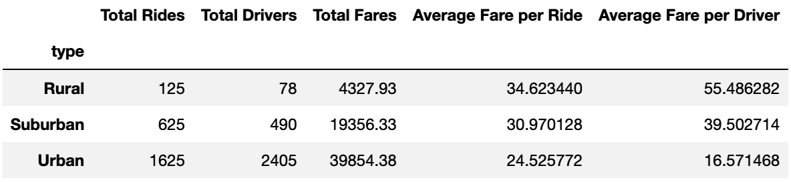
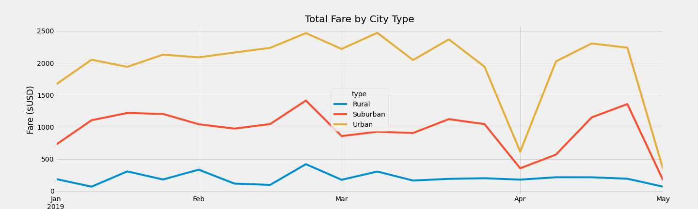

# PyBer Analysis with Matplotlib

## Overview of Project

* PyBer is a Python-based ride-sharing company that needs to analyze ride-sharing data 
* Data analysis will help decision-makers at PyBer conduct business strategy 

### Purpose

* To perform a data analysis by city type
* To use the results from the data analysis to provide business recommendations to PyBer's CEO for addressing disparities among the city types 

## Results

### Ride-sharing Summary DataFrame by City Type

* Urban cities have the most economic activity: Therefore, they have the most rides, drivers, and fares. 
* Suburban cities are in the middle for all of the indicators of economic activity. 
* Rural cities have the least economic activity: As a result of the lower supply of drivers, they have the highest average fare per ride and average fare per driver. 
* See DataFrame: 

### Multiple-line Chart of Total Fare by City Type

* Total fares by city type remain the same each month: Urban, Suburban, Rural
* See chart: 

## Summary: Business Recommendations

1. It is necessary to identify if the significant decrease in rides and drivers in rural cities occurs due to a decrease in    supply or a decrease in demand, relative to urban cities. More precisely, it should be determined if one effect is greater. In economics the supply and demand model reveals equilibrium quantity and price, or in this case the number of rides and fare per ride. Economic theory suggests that rural cities have lower supply and demand than rural cities. However, the question remains if the impact of one decrease, in supply or demand, outweighs the other in determining the economic activity of rural cities. 

    Further analysis should be done, in which data analysts use the PyBer app to identify the number of requests from app users and their average wait time in the different cities. Through obtaining this information, the demand for PyBer rides can be estimated. Once the demand is estimated for each city type, analysts can decide if lack of demand or lack of supply is driving the decreased economic activity in these areas. For instance, if PyBer completes the data analysis recommended and finds that riders in rural cities have a signficiantly longer wait time than riders in other areas, this indicates that there is a lack of supply problem in rural cities.

2. If supply for PyBer rides in rural cities or suburban cities seems to be the primary factor in the decrease in their economic activity, then PyBer should incentivize drivers to drive in the affected cities by offering an increase in the fare per ride ($USD) for rides in those cities. On the other hand, if demand for PyBer rides in rural and suburban cities seems to be the primary factor, then this incentive would be illogical, as an increase in the supply would not change the economic activity. 

3. Total fares significantly decrease in urban cities at the beginning of April and May. Further examination of the data is necessary due to the difficulty of pinpointing the causes of these reductions. Similar to the above recommendations, it is important to figure out if these reductions occured as a result of fewer ride requests or if there happened to be a lack of supply of drivers at the beginning of each month. Once further data analysis is conducted to decide the primary factor in these reductions, PyBer can make decisions accordingly. 